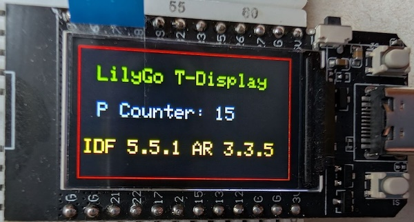

# ESP32 LilyGo T-Display Easily transform the development for your ESP32 project from Arduino to PlatformIO

This is the accompanying repository for my article "**LilyGo T-Display Easily transform the development for your ESP32 project from Arduino to PlatformIO**" available here: https://medium.com/@androidcrypto/lilygo-t-display-easily-transform-the-development-for-your-esp32-project-from-arduino-to-platformio-654b4eb918c8

The code for the tutorial "**How you work with multiple configurations on your ESP32 PlatformIO project**" () is placed here as well.

## Sketches

Arduino version: [Esp32_T_Display_Adafruit_Transition_v01](https://github.com/AndroidCrypto/ESP32_Transist_from_Arduino_to_PlatformIO/tree/main/Esp32_T_Display_Adafruit_Transition_v01)

PlatformIO version: [Esp32_T-Display_Adafruit_Transition_v02](https://github.com/AndroidCrypto/ESP32_Transist_from_Arduino_to_PlatformIO/tree/main/Esp32_T-Display_Adafruit_Transistion_v02)

PlatformIO Work with multiple Configurations code: [Esp32_T-Display_Adafruit_Transition_v02](https://github.com/AndroidCrypto/ESP32_Transist_from_Arduino_to_PlatformIO/tree/main/Esp32_T-Display_Adafruit_Transistion_v03)

## Resources for PlatformIO

- Installation notes: https://platformio.org/platformio-ide

- Download Microsoft Visual Studio Code: https://code.visualstudio.com/

- Notes to install the PlatformIO extension: https://platformio.org/install/ide?install=vscode

- Quick Start Guide: https://docs.platformio.org/page/ide/vscode.html#quick-start

- PlatformIO Registry: https://registry.platformio.org/

- ESP32 boards with pre-definedsettings: https://medium.com/r/?url=https%3A%2F%2Fgithub.com%2Fplatformio%2Fplatform-espressif32%2Ftree%2Fdevelop%2Fboards

- ESP32 IDF version (pioarduino): https://github.com/platformio/platform-espressif32/releases



- ## Development Environment (Arduino)
````plaintext
Arduino IDE Version 2.3.6 (Windows)
arduino-esp32 boards Version 3.2.0 (https://github.com/espressif/arduino-esp32)
````

- ## Development Environment (PlatformIO)
````plaintext
Microsoft Visual Studio Code Version 1.107.1 (MacOS)
PlatformIO extension Core 6.1.18 Home 3.4.4
ESP32 platform: https://github.com/pioarduino/platform-espressif32/releases/download/55.03.35/platform-espressif32.zip
````
